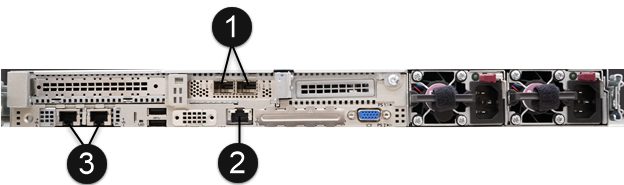

= インストールの前提条件となるタスクを実行します
:allow-uri-read: 
:icons: font
:imagesdir: ../media/

[role="lead"]
SolidFire ESDS をインストールする前に、必要なチェックを実行し、お使いの環境が構成、 IP アドレス指定、およびネットワーク要件を満たしていることを確認してください。

.<strong> 必要なハードウェアを設置する </strong>
* サポートされているサーバをインストールします。を参照してください https://mysupport.netapp.com/matrix/imt.jsp?components=97283;&solution=1757&isHWU#welcome["NetApp Interoperability Matrix （ログインが必要）"^] を参照してください。
* ハードウェア構成のバランスがとれ、すべてのチャネルが設定されていることを確認します。帯域幅の最大化の詳細については、を参照してください https://kb.netapp.com/Advice_and_Troubleshooting/Data_Storage_Software/SolidFire_Enterprise_SDS/How_to_balance_memory_and_maximize_bandwidth_for_your_hardware_configurations["こちらの技術情報アーティクル"^] （ログインが必要です）。

.<strong> ホスト（ノード）を設定 </strong> します
* に記載されているサポート対象のバージョンに基づいてRed Hat Package Managerをインストールします https://mysupport.netapp.com/matrix/imt.jsp?components=97283;&solution=1757&isHWU#welcome["NetApp Interoperability Matrix （ログインが必要）"^]。
* ネットワーク内のすべてのホストで使用するネットワークタイムプロトコル（ NTP ）サーバを設定します。
* インストール先を選択するときに、オプションボタンを選択してファイルシステムのパーティショニングを手動で設定します。[* 手動パーティション分割 *] ページで、 [*+*] および [*-*] ボタンを使用して既存のパーティションを削除し、ここに記載されている推奨事項に従って新しいパーティションを作成してサイズを設定します。デフォルトの LVM パーティショニングスキームを使用すると、必要に応じてあとから簡単にサイズを変更できます。
+

NOTE: デフォルトでは'Red Hat Package Managerは'手動で作成するパーティションのデフォルト・ファイル・システムとしてxfsを選択しますこれは '/boot' パーティションと 'swap' パーティションを除いて 'ext4 に変更する必要がありますあなたの「 /boot 」パーティションは「 ext2 」を使うべきです。

+
SATA ディスクに 250GB がある場合は、次の推奨パーティションに従ってください。SATA ディスクの空き容量が大きい場合は、 /opt と /var パーティションのサイズを大きくできます。

+
[cols="2*"]
|===
| パーティション | サイズ 

 a| 
/boot
 a| 
1GB

 a| 
/opt
 a| 
50 GB

 a| 
/var
 a| 
50 GB

 a| 
スワップ（ Swap ）
 a| 
4 GB

 a| 
ホーム
 a| 
5 GB

 a| 
/
 a| 
10Gb 以上

 a| 
/usr
 a| 
10Gb 以上

|===
+

NOTE: /dev/sdb ディスクはどのプロセスでも使用されていません

* /boot に対して RAID を無効にします。
* [ソフトウェアの選択]画面で、インストールする特定のパッケージを選択し、Red Hat Package Managerのバージョンに基づいて*Server*または*Infrastructure Server*を選択します。
* 最初のブート後、次の手順を実行します。
+
** Red Hat Subscription Manager をインストールし、次のリポジトリを有効にします。
+
[listing]
----

rhel-7-server-ansible-2.9-rpms
rhel-7-server-optional-rpms
rhel-7-server-extras-rpms
----
** ノードで SSH を有効にします。
** IPv6 を無効にする場合は、このセクションで説明する手順を実行します https://kb.netapp.com/Advice_and_Troubleshooting/Data_Storage_Software/SolidFire_Enterprise_SDS/How_to_disable_IPv6_for_SolidFire_eSDS["技術情報アーティクル（ログインが必要です"^]。

.<strong> 必要なソフトウェアをインストールする </strong>
* Ansible 、 Git 、 Podman 、 Python 3.0 をインストールします。
+
[NOTE]
====
Element 12.5でサポートされるPodmanのバージョンは、Red Hat Package Managerのバージョンによって異なります。

[cols="35,65"]
|===
| Red Hat Package Managerのバージョン | Podmanバージョン 

| 7.x | 1.6.4 

| 8.1、8.2、8.3、8.4の各モデルがサポートされます  a| 
3.1.x、3.2.x、3.3.x、3.4.1、および3.4.2

NOTE: 利用可能な場合は、Podmanバージョン用のセキュリティ更新プログラムを受け入れることを推奨します。

|===
====

.<strong>SolidFire ESDS をインストールするための NetApp の要件と構成が一致していることを確認します </strong>
* に記載されている SolidFire ESDS 構成を使用します https://mysupport.netapp.com/matrix/#welcome["ネットアップの Interoperability Matrix Tool （ IMT ）"] を参照してください。
+

IMPORTANT: SolidFire ESDS に関する問題についてサポートが必要な場合は、まず、ご使用のプラットフォームが IMT に記載されている SolidFire ESDS の参照構成に準拠していることを確認します。サポートが基盤のプラットフォームがリファレンス構成に準拠していないと判断した場合は、非準拠のファームウェア、ソフトウェア、ハードウェアのコンポーネントを IMT の正しいバージョンに合わせて調整する手順がサポートによってガイドされます。

* SolidFire ESDS の準拠チェックを実行します。
+
.. 'Ansible galxy install コマンドを実行して 'nar_solidfire_sds_compliance ロールをインストールします
+
[listing]
----
ansible-galaxy install git+https://github.com/NetApp-Automation/nar_solidfire_sds_compliance.git
----
+
ロールは、からコピーして手動でインストールすることもできます https://github.com/NetApp-Automation["NetApp GitHub リポジトリ"^] そして '~/. epla/roles ディレクトリにロールを配置しますネットアップは README ファイルを提供しています。このファイルには、ロールの実行方法に関する情報が含まれています。

+

NOTE: 必ず最新バージョンのロールをダウンロードしてください。

.. ダウンロードしたロールを、インストールしたディレクトリから 1 つ上のディレクトリに移動します。
+
[listing]
----
 $ mv ~/.ansible/roles/ansible/nar_solidfire_sds_* ~/.ansible/roles/
----
.. 「 Ansible galxy role list 」コマンドを実行して、新しい役割を利用するように Ansible が設定されていることを確認します。
+
[listing]
----
 - nar_solidfire_sds_install, (unknown version)
 - nar_solidfire_sds_upgrade, (unknown version)
 - ansible, (unknown version)
 - nar_solidfire_sds_compliance, (unknown version)
 - nar_solidfire_cluster_config, (unknown version)
 - nar_solidfire_sds_uninstall, (unknown version)
----
.. 準拠チェックに使用するプレイブックを作成します。
.. 次の例に示すように、準拠チェックプレイブックを実行します。
+
[listing]
----
 $ ansible-playbook -i yourinventory.yml yourplaybook.yml
----

+

NOTE: SolidFire ESDS システムの使用を開始した後でも、定期的に準拠チェックを実行して、システムが準拠していることを確認する必要があります。場合によっては、ネットアップサポートから、準拠チェックを実行して問題の診断とトラブルシューティングを依頼されることがあります。

.<strong> ネットワークと IP アドレスの要件を理解する </strong>
* Red Hat Package Managerでネットワークとネットワークインターフェイスを設定および管理する方法について説明します。を参照してください https://access.redhat.com/documentation/en-us/red_hat_enterprise_linux/7/html/networking_guide/index["Red Hat のドキュメント"^]。
* ここで説明する IP 要件に従ってネットワークを設定します。
+
[cols="4*"]
|===
| コンポーネント | ストレージネットワークの IP アドレス | 管理ネットワークの IP アドレス | IP アドレスの総数 

 a| 
ストレージノード
 a| 
1.
 a| 
1.
 a| 
ノードあたり 2 本

 a| 
管理ノード
 a| 
（オプション） 1.
 a| 
1.
 a| 
ストレージネットワーク上のクラスタごとに 1 つ、管理ネットワーク上のクラスタごとに 1 つ、管理ノードのクラスタごとに 1 つの FQDN

 a| 
ストレージクラスタ
 a| 
ストレージ IP （ SVIP ） × 1
 a| 
管理 IP （ MVIP ） × 1
 a| 
ストレージクラスタあたり 2 本

|===
* 25GbE イーサネットスイッチでストレージネットワークを設定し、 10GbE スイッチで管理ネットワークを設定します。次の配線図を参照してください。
+

+
[cols="2*"]
|===
| 項目 | 説明 

| 1.  a| 
ストレージネットワークのポート

 a| 
2.
 a| 
IPMI のポート

 a| 
3.
 a| 
管理ネットワーク用のポート

|===

IMPORTANT: ここで示す図は例です。実際のハードウェアは、お使いのサーバによって異なる場合があります。

* スイッチポートの MTU を 9216 バイトに変更します。

.<strong> データセンターのファイアウォールで特定のポートを許可する </strong>
* Red Hat Package Managerを実行しているストレージノードで「firewalld」が有効になっている場合は、次のポートが開いていることを確認します。これにより、システムをリモートで管理し、データセンターの外部のクライアントがリソースに接続できるようになり、内部サービスが正常に機能するようになります。
+
[cols="4*"]
|===
| ソース | 宛先 | ポート | 説明 

 a| 
ストレージノードの MIP
 a| 
管理ノード
 a| 
80 TCP/UDP
 a| 
クラスタのアップグレード

 a| 
SNMP サーバ
 a| 
ストレージノードの MIP
 a| 
161 UDP
 a| 
SNMP ポーリング

 a| 
システム管理者の PC
 a| 
管理ノード
 a| 
442 TCP
 a| 
管理ノードへの HTTPS UI アクセス

 a| 
システム管理者の PC
 a| 
ストレージノードの MIP
 a| 
442 TCP
 a| 
ストレージノードへの HTTPS UI アクセス

 a| 
iSCSI クライアント
 a| 
ストレージクラスタの MVIP
 a| 
443 tcp
 a| 
（オプション） UI および API アクセス

 a| 
管理ノード
 a| 
monitoring.solidfire.com
 a| 
443 tcp
 a| 
Active IQ に報告するストレージクラスタ

 a| 
ストレージノードの MIP
 a| 
リモートストレージクラスタの MVIP
 a| 
443 tcp
 a| 
リモートレプリケーションのクラスタペアリング通信

 a| 
ストレージノードの MIP
 a| 
リモートストレージノードの MIP
 a| 
443 tcp
 a| 
リモートレプリケーションのクラスタペアリング通信

 a| 
SolidFire eSDSsfapp
 a| 
ノード UI および API アクセスでクラスタを作成できます
 a| 
2010 UDP
 a| 
クラスタビーコン（クラスタに追加するノードを検出するため）

 a| 
iSCSI クライアント
 a| 
ストレージクラスタの SVIP
 a| 
3260 TCP
 a| 
クライアント iSCSI 通信

 a| 
iSCSI クライアント
 a| 
ストレージクラスタの SIP
 a| 
3260 TCP
 a| 
クライアント iSCSI 通信

 a| 
SOAP サーバ
 a| 
SolidFire eSDSsfapp
 a| 
7627 TCP
 a| 
SOAP Web サービス

 a| 
システム管理者の PC
 a| 
該当なし
 a| 
8080 TCP
 a| 
システム管理者の通信

 a| 
vCenter Server の各サービスを提供
 a| 
管理ノード
 a| 
8443 / TCP
 a| 
vCenter Plug-in の QoSSIOC サービス

|===
+

NOTE: では、 Element 分散データベースにポート 2181 、 2182 、および 2183 が必要です。 SolidFire ESDS をインストールすると、 Element コンテナから動的に開かれます。

* 上記のポートを開くには、次のコマンドを使用します。
+
[listing]
----
systemctl start firewalld
firewall-cmd --permanent --add-service=snmp
firewall-cmd --permanent --add-port=80/tcp
firewall-cmd --permanent --add-port=80/udp
firewall-cmd --permanent --add-port=442-443/tcp
firewall-cmd --permanent --add-port=442-443/udp
firewall-cmd --permanent --add-port=2010/udp
firewall-cmd --permanent --add-source-port=2010/udp
firewall-cmd --permanent --add-port=3260/tcp
firewall-cmd --permanent --add-port=7627/tcp
firewall-cmd --permanent --add-port=8080/tcp
firewall-cmd --permanent --add-port=8443/tcp
firewall-cmd –-reload
----

.<strong> ホストネットワークを設定 </strong>
* を使用してホストネットワークを設定します link:task_esds_configure_the_interface_config_files.html["ベストプラクティス"^] 提供されます。
+

IMPORTANT: SolidFire ESDS を正常にインストールするには、ホストネットワークを設定する手順を実行する必要があります。

.<strong> 追加要件を満たす </strong>
* 1 つの Collect をインストールします。この収集は、ネットアップサポートがホストログを収集するために使用します。から収集したデータは 1 つインストールできます https://mysupport.netapp.com/site/tools/tool-eula/activeiq-onecollect["こちらをご覧ください"^]。ダウンロードにアクセスするには、ネットアップアカウントが必要です。『 Collect Installation Guide 』と『 Release Notes 』も同じ場所にあります。
+

NOTE: 最適なサポートを受けるには、収集したものを 1 つダウンロードしてインストールする必要があります。

* ログを収集する管理ノードをインストールし、ネットアップサポートがトラブルシューティングにアクセスできるようにします。管理ノードとインストールの手順については、を参照してください link:../mnode/task_mnode_install.html["こちらをご覧ください"^]。

== 詳細については、こちらをご覧ください

* https://www.netapp.com/data-storage/solidfire/documentation/["NetApp SolidFire のリソースページ"^]
* https://docs.netapp.com/sfe-122/topic/com.netapp.ndc.sfe-vers/GUID-B1944B0E-B335-4E0B-B9F1-E960BF32AE56.html["以前のバージョンの NetApp SolidFire 製品および Element 製品に関するドキュメント"^]

