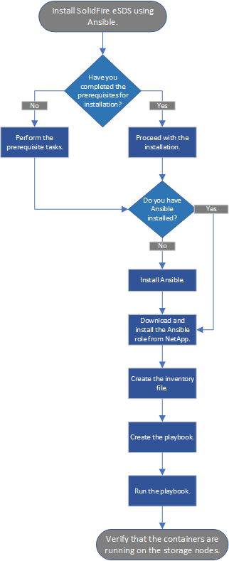

= NetApp SolidFire エンタープライズ SDS の導入を始めましょう
:allow-uri-read: 
:icons: font
:imagesdir: ../media/

[role="lead"]
NetApp SolidFire エンタープライズ SDS （ ESDS ）は、 SolidFire スケールアウトテクノロジと NetApp Element ソフトウェアデータサービスのメリットを、 SolidFire ESDS のリファレンス構成を満たす任意のハードウェア上で提供します。SolidFire ESDS は、基盤となるハードウェアに依存しない NetApp Element ソフトウェアを提供します。これにより、ネットアップブランドのアプライアンスまたは汎用サーバの Element 機能をすべて使用できるようになります。このサーバは、ネットアップのリファレンス構成に準拠します。

== SolidFire ESDS の主な機能

* コンテナを使用して Element ソフトウェアをインストールして実行できます。
* 検証済みの汎用サーバプラットフォームを使用して、エンタープライズストレージの機能と信頼性を実現します。所定の x86 サーバプラットフォームおよび基盤となるコンポーネント（ CPU 、メモリ、 SSD ドライブ、キャッシュ、ネットワーク、 SolidFire ファームウェア）。で公開されているリファレンス構成ごとに表示されます https://mysupport.netapp.com/matrix/imt.jsp?components=97283;&solution=1757&isHWU&src=IMT["ネットアップの Interoperability Matrix Tool （ IMT ）"]。
* 保存中のソフトウェア暗号化を提供します。保存データのソフトウェア暗号化を使用すると、ストレージクラスタ内の SSD に書き込まれるすべてのデータを暗号化できます。これにより、自己暗号化ドライブ（ SED ）を搭載していない SolidFire ESDS ノードで、暗号化の一次レイヤが提供されます。
* Quality of Service （ QoS ；サービス品質）ポリシーを使用して予測可能なクラスタパフォーマンスを提供します。
* では、 4~40 ノードのクラスタがサポートされます。
* Term Capacity ライセンスモデルでライセンス付与されます。
* は、テクノロジパートナーとのサポート契約を利用してサポートを提供する新しいモデルを使用します。

ネットアップは、 SolidFire ESDS を通じて Element 用のコンテナを提供し、必要な要件を満たすコモディティハードウェア上での実行を可能にします。オペレーティングシステムがインストールされた独自のサーバを使用します。Ansible などの自動化ツールを使用して、インストール前のコンプライアンスチェックを実行し、 SolidFire ESDS をインストールします。インストール前のセットアップタスクでは、ログバンドルの収集や SolidFire AIQ などのその他のサービスをサポートするために、管理ノードをインストールする必要があります。SolidFire ESDS 環境のさまざまなコンポーネントを示すアーキテクチャの概要を次に示します。

image::../media/esds_architecture_overview.png[に、 ESDS 環境のアーキテクチャの概要を示します。]

NOTE: プラットフォームのライフサイクルの設定、監視、管理、およびネットワークインターフェイスとルーティングテーブルの設定は、ユーザ自身で行う必要があります。

NetApp Element ソフトウェアの一部の機能は、 SolidFire ESDS には適用されません。ハードウェアの監視、ファームウェアの更新、自己暗号化ドライブ（ SED ）を搭載した保存データの暗号化（ EAR ）、 SolidFire ESDS ではファイバチャネルなど、従来の SolidFire ストレージノードの Element 機能はネイティブでは無効になっています。

* 外部キー管理（ EKM ）
* ハードウェア暗号化
* マルチドライブスライスサービス（ MDSS ）
* ハードウェアの監視、ホストプラットフォームの更新（ドライバ、ファームウェア、オペレーティングシステムパッケージなど）、およびファイバチャネル

== クイックスタート情報

SolidFire ESDS をインストールするための手順を簡潔に説明します link:../media/SDS_Quick_Start_Guide.pdf["こちらをご覧ください"^]。

== ライセンスポリシー

SolidFire ESDS は、ネットアップの用語容量ライセンスモデルによって管理されます。

このモデルのポリシーの概要を以下に示します。

* ソフトウェアコストは物理容量（ドライブのサイズとノードまたはクラスタ内のドライブ数）に基づいて算出されるため、このモデルのソフトウェアコストを簡単に予測できます。
* ソフトウェアライセンスキーは必要ありません。注文後に受け取ったドキュメントキットに含まれているセールスオーダーには、ソフトウェアのマスターシリアル番号が記載されています。このマスターシリアル番号はサポート資格に使用されるため、保持しておく必要があります。

詳細については、を参照してください https://www.netapp.com/us/media/sb-4059.pdf["NetApp HCI および SolidFire の購入モデル"]。

== SolidFire ESDS をインストールおよび使用するためのインターフェイス

SolidFire ESDS のインストール、監視、および管理に使用するツールとインターフェイスのリストを次に示します。

[cols="3*"]
|===
| ツール / インターフェース | 誰が使用するか | 説明 

 a| 
Ansible のコンプライアンスチェックロール
 a| 
お客様
 a| 
プラットフォームがに記載されている参照構成と一致することを確認するため https://mysupport.netapp.com/matrix/imt.jsp?components=97283;&solution=1757&isHWU&src=IMT["NetApp Interoperability Matrix Tool （ログインが必要）"^]。この作業は、 SolidFire ESDS をインストールする前に実行する必要があります。

 a| 
Ansible のインストールロール
 a| 
お客様
 a| 
SolidFire ESDS のインストール用。

 a| 
管理ノード
 a| 
お客様
 a| 
AIQ などのログバンドルの収集と管理サービス用。

 a| 
NetApp Hybrid Cloud Control の略
 a| 
お客様とネットアップサポート
 a| 
クラスタの作成、ノード単位の管理、および管理ノードからのログ収集用。

 a| 
Hewlett Packard Enterprise （ HPE ） Integrated Lights Out （ iLO ）
 a| 
お客様、 HPE サポート
 a| 
ルート原因分析のイベントとステータスに関するデータを収集するため。

 a| 
Dell Integrated Dell Remote Access Controller （ iDRAC ）
 a| 
お客様、デルサポート
 a| 
ルート原因分析のイベントとステータスに関するデータを収集するため。

 a| 
NetApp Element ソフトウェア UI
 a| 
お客様
 a| 
SolidFire ESDS ストレージクラスタの管理用。

 a| 
Active IQ
 a| 
お客様とネットアップサポート
 a| 
クラスタの健常性ステータスの監視用。

 a| 
1 回の収集
 a| 
ネットアップサポート
 a| 
補足的なログ収集の場合。

|===

== インストールの概要

SolidFire ESDS は、 Ansible などの自動化ツールを使用してインストールできます。

以下は Ansible を使用したインストールの概要です。

== 動的ノードレーティング

Element 12.1-1で導入された動的ノード評価では、現在のプラットフォームごとに1つのCPUモデルではなく、ESDSプラットフォームごとに24個のサポートされているCPUを利用できます。

動的ノード評価は、現在 ESDS でサポートされているすべてのプラットフォーム（ DL360 、 DL380 、 R640 ）でサポートされています。

ノードの動的な評価の初回リリースでは、どのノードでも最大 IOPS 定格は 100K です。

== 詳細については、こちらをご覧ください

* https://www.netapp.com/data-storage/solidfire/documentation/["NetApp SolidFire のリソースページ"^]
* https://docs.netapp.com/sfe-122/topic/com.netapp.ndc.sfe-vers/GUID-B1944B0E-B335-4E0B-B9F1-E960BF32AE56.html["以前のバージョンの NetApp SolidFire 製品および Element 製品に関するドキュメント"^]

