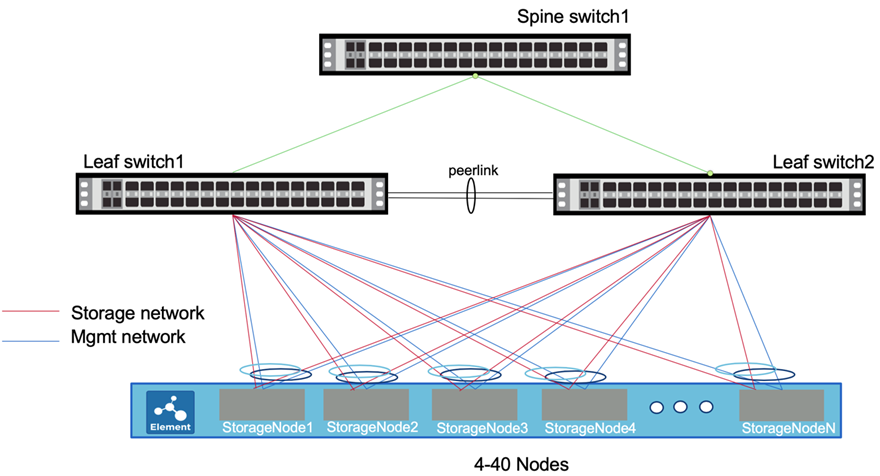

= ホストネットワークを設定します
:allow-uri-read: 
:icons: font
:imagesdir: ../media/

[role="lead"]
SolidFire ESDS をインストールする前に、ホストネットワークを設定する例とヒントを使用してください。

ネットワーク設定の例を次に示します。

この例では、ストレージノード上の 2 つのインターフェイスはネットワークです https://access.redhat.com/documentation/en-us/red_hat_enterprise_linux/7/html/networking_guide/ch-configure_network_teaming#sec-Understanding_Network_Teaming["チーム化"^] 冗長性を確保するために管理ネットワークに接続します。同様に、 2 つの追加のインターフェイスがチーム化され、ストレージネットワークに接続されます。

NOTE: 各インターフェイスには、 ifcfg-< インターフェイス名 >X という名前のコンフィギュレーションファイルがあります。 X は、使用する命名規則に応じて、 0 または 1 から始まるインターフェイスの番号です。インターフェイスを最初に作成すると、構成ファイルが作成されます。ストレージネットワークに接続されている 2 つの物理インターフェイスごとに、 1 つの構成ファイルがすでに存在している必要があります。管理ネットワークに接続されている 2 つの物理インターフェイスごとに、 1 つの構成ファイルも存在する必要があります。インターフェイス構成ファイルは、 /etc/sysconfig/network-scripts ディレクトリに配置されます。を参照してください https://access.redhat.com/documentation/en-us/red_hat_enterprise_linux/7/html/networking_guide/getting_started_with_networkmanager["インターフェイス構成ファイル"^]。

TIP: ここに示す例では、 HPE サーバのストレージおよび管理インターフェイス名を使用しています。Dell サーバーを使用している場合、インターフェイス名は異なります。Dell サーバーのストレージインタフェース名は、 em1 および EM2 です。Dell サーバの管理インターフェイス名は p3p1 および p3p2 です。

.手順
. 「 NetworkManager-dispatcher-routing-rules 」パッケージをインストールし、適切なリポジトリが設定されていることを確認します。
. スイッチベンダーのマニュアルを参照して、ネットワークスイッチを設定します。Multi-chassis Link Aggregation Group （ MLAG ；マルチシャーシリンクアグリゲーショングループ）プロトコルと Link Aggregation Control Protocol （ LACP ）の設定手順については、スイッチベンダーのマニュアルを参照してください。
+

NOTE: LACP フォールバックを設定し 'no lacp suspend-individual' を実行して LACP 個のポート・サスペンションの動作をディセーブルにすることを推奨しますこれにより、設定ミスの場合に LACP パケットがブロードキャストされなくても、 AccessPoint リンクがアップすることができます。

. 次の例を使用して、ストレージネットワークに接続されている物理インターフェイスの 2 つの構成ファイルを編集します。ストレージネットワークではジャンボフレームを設定することを推奨しますが、必須ではありません。次の例では、ストレージインターフェイス名は ens2f0 、ストレージチーム名は team10G です。
+

IMPORTANT: ここに示すすべての設定例では、 name と device で同じ値が使用されています。別の値を使用することもできます。

+
[listing]
----
# cat /etc/sysconfig/network-scripts/ifcfg-ens2f0
# 10G Team Physical Port to Storage Network
NAME=ens2f0
DEVICE=ens2f0
ONBOOT=yes
TEAM_MASTER=team10G
DEVICETYPE=TeamPort
MTU=9000
----
. 次の例を使用して、管理ネットワークに接続されているインターフェイスの 2 つの構成ファイルを編集します。この例では、管理インターフェイス名は eno5 で、管理チーム名は team1G です。
+
[listing]
----
# cat ifcfg-eno5
# 1G Team Physical Port to Management Network
NAME=eno5
DEVICE=eno5
ONBOOT=yes
TEAM_MASTER=team1G
DEVICETYPE=TeamPort
----
. 次の例を使用して、ストレージチーム用のチームインターフェイスファイルを作成します。この例では、チームは team10G と呼ばれます。ネットワークチーミング LACP ランナーを実行しているストレージネットワーク上にあります。
+

NOTE: ストレージ・インターフェイスには、アクティブ / アクティブ構成が推奨されます。この構成では、追加のアクティブ / アクティブ Multi-chassis Link Aggregation Group （ MLAG ；マルチシャーシリンクアグリゲーショングループ）プロトコルと Link Aggregation Control Protocol （ LACP ）をスイッチで設定する必要があります。この設定にはが必要です https://access.redhat.com/documentation/en-us/red_hat_enterprise_linux/7/html/networking_guide/sec-Understanding_the_Network_Teaming_Daemon_and_the_Runners["ネットワークチーミング LACP ランナ"^]。

+
[listing]
----
# cat /etc/sysconfig/network-scripts/ifcfg-team10G
# IPADDR= "SIP"
# GATEWAY= "SIP_GATEWAY"
# Pick one TEAM_CONFIG, activebackup or lacp
# note that lacp require changing switch port to lacp as well

TEAM_CONFIG="{\"runner\": {\"name\": \"lacp\"}, \"link_watch\": {\"name\": \"ethtool\"}}"
PROXY_METHOD=none
BROWSER_ONLY=no
BOOTPROTO=none
DEFROUTE=no
IPV4_FAILURE_FATAL=no
IPV6INIT=no
NAME=team10G
DEVICE=team10G
ONBOOT=yes
DEVICETYPE=Team
IPADDR=192.0.2.2
PREFIX=24
GATEWAY=192.0.2.1
NM_CONTROLLED=yes
MTU=9000
----
. 次の例を使用して、管理チーム用のチームインターフェイスファイルを作成します。この例では、チームは team1G と呼ばれます。ネットワークチーミングアクティブバックアップランナーを実行している管理ネットワーク上にあります。
+

NOTE: アクティブ / パッシブ構成は管理インターフェイスに推奨されますが、アクティブ / アクティブ構成も使用できます。これには、リーフスイッチでの追加設定は必要ありません。この設定ではを使用します https://access.redhat.com/documentation/en-us/red_hat_enterprise_linux/7/html/networking_guide/sec-Understanding_the_Network_Teaming_Daemon_and_the_Runners["ネットワークチーミングアクティブバックアップランナー"]。

+
[listing]
----
# cat /etc/sysconfig/network-scripts/ifcfg-team1G
# IPADDR= "MIP"
# GATEWAY= "MIP_GATEWAY"
# DNS1= "DNS"
# Pick one TEAM_CONFIG, activebackup or lacp
# note that lacp require changing switch port to lacp as well

TEAM_CONFIG="{\"runner\": {\"name\": \"activebackup\"}, \"link_watch\": {\"name\": \"ethtool\"}}"
#TEAM_CONFIG=”{ \”runner\”: {\”name\”: \”lacp\”, \”active\”: true, \”fast_rate\”: true }}”
PROXY_METHOD=none
BROWSER_ONLY=no
BOOTPROTO=none
DEFROUTE=yes
IPV4_FAILURE_FATAL=no
IPV6INIT=no
IPV6_AUTOCONF=yes
IPV6_DEFROUTE=yes
IPV6_FAILURE_FATAL=no
IPV6_ADDR_GEN_MODE=stable-privacy
NAME=team1G
DEVICE=team1G
ONBOOT=yes
DEVICETYPE=Team
IPADDR=198.51.100.2
PREFIX=24
GATEWAY=198.51.100.1
DNS1=198.51.100.250
NM_CONTROLLED=yes
----
. /etc/iproute2/rT_tables ファイルを編集して ' 次のサンプルを使用して新しいルーティングテーブルを有効にしますこのファイルでは、インデックス番号ではなくルーティングテーブル名を使用して特定のテーブルを参照するようにマッピングを定義します。次の例では、 team10G という名前の新しいストレージルーティングテーブルを、インデックス（ 20 ）またはその名前（ team10G ）で呼び出すことができます。
+
[listing]
----
# cat /etc/iproute2/rt_tables
#
# reserved values
#
255local
254main
253default
0unspec

20   team10G
----
. 次の例を使用して、ストレージトラフィックのルーティングテーブルにルートを追加します。このルーティングテーブルはデフォルトゲートウェイとしてストレージネットワークを指し、 iSCSI トラフィックに使用する必要があります。次の例では、チーム化されたインターフェイス名は team10G です。
+

NOTE: 「 $storage_network` 」、「 $storage_if_name src 」、「 $sip table 」、「 $routing_table_name 」、「 $storage_default_gw dev 」を置き換える必要があります。 $storage_if_name src` 、 `$sip table` 、およびあなた自身の値を持つ `$routing_table_name` 。

+
[listing]
----
# cat /etc/sysconfig/network-scripts/route-team10G
$storage_network/24 dev $storage_if_name src $SIP table $routing_table_name
default via $storage_default_gw dev $storage_if_name src $SIP table \
$routing_table_name
----
. トラフィックが SIP または SVIP から発信される場合、作成した新しいルーティングテーブルを使用するポリシーベースのルーティングを追加します。次の例を使用して、を独自の値に置き換えます。
+
[listing]
----
# cat /etc/sysconfig/network-scripts/rule-team10G
from $SIP table
$routing_table_name
----
. すべての変更を適用するには、ネットワークを再起動します。
+
[listing]
----
# systemctl restart network.service
----
. ポリシーベースのルーティングルールをチェックするには、 ip rule show コマンドを実行します。
. ルーティング・テーブルを確認するには 'ip route show table' コマンドを実行します

== 詳細については、こちらをご覧ください

* https://www.netapp.com/data-storage/solidfire/documentation/["NetApp SolidFire のリソースページ"^]
* https://docs.netapp.com/sfe-122/topic/com.netapp.ndc.sfe-vers/GUID-B1944B0E-B335-4E0B-B9F1-E960BF32AE56.html["以前のバージョンの NetApp SolidFire 製品および Element 製品に関するドキュメント"^]

