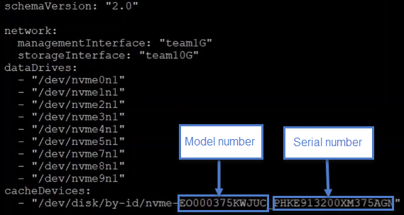

= HPE DL360 のドライブを交換
:allow-uri-read: 
:icons: font
:imagesdir: ../media/

[role="lead"]
ここに記載されている手順に従って、ドライブをプロアクティブに交換し、障害が発生したドライブを交換し、キャッシュドライブを交換します。SolidFire ESDS クラスタ内のメタデータドライブまたはブロックドライブを交換します。Element UI * Cluster > Drives * ページには、ドライブ摩耗度情報が表示されます。

* <<ドライブをプロアクティブに交換します>>
* <<障害のあるドライブを交換します>>
* <<キャッシュドライブを交換します>>

== ドライブをプロアクティブに交換します

SolidFire ESDS クラスタ内のメタデータドライブまたはブロックドライブをプロアクティブに交換する場合は、この手順を実行します。Element UI * Cluster * > * Drives * ページには、ドライブ摩耗度情報が表示されます。

.必要なもの
* NetApp Element ソフトウェア UI で、クラスタの健常性が良好であり、警告やクラスタ障害がないことを確認します。Element UI には、プライマリクラスタノードの管理仮想 IP （ MVIP ）アドレスを使用してアクセスできます。
* クラスタで実行中のアクティブなジョブがないことを確認します。
* すべての手順を理解していることを確認します。
* ドライブを取り扱う際には、静電放電（ ESD ）を防ぐために必要な予防措置を講じてください。

.手順
. Element UI で次の手順を実行します。
+
.. Element UI で、 * Cluster * > * Drives * > * Active * を選択します。
.. 交換するドライブを選択します。
.. ドライブのシリアル番号をメモします。これは、ノードの IPMI インターフェイス（この場合は HPE Integrated Lights-Out または iLO ）で対応する BayID を特定するのに役立ちます。
.. [ * 一括操作 * > * 削除 * ] を選択します。ドライブを取り外した後、ドライブは「 Removing * 」 ( 取り外し中 ) 状態になります。この処理は「削除中」のままです。ドライブ上のデータが同期されるか、クラスタ内の残りのドライブに再配置されるのを待っています。削除が完了すると、ドライブは * Available * 状態になります。

. 次の手順を実行して、交換するドライブのドライブスロットの位置を確認します。
+
.. ノードの IPMI インターフェイス（この場合は iLO ）にログインします。
.. 左側のナビゲーションから「 * システム情報 * 」を選択し、「 * ストレージ * 」を選択します。
.. 前の手順でメモしたシリアル番号を、画面に表示されている番号と一致させます。
.. 表示されているスロット番号をシリアル番号と照合して確認します。ドライブを取り外す必要がある物理スロットです。

. ドライブを特定したら、次のようにドライブを物理的に取り外します。
+
.. ドライブベイを特定します。
+
次の図は、イメージの左側にドライブベイの番号が表示されたサーバーの前面を示しています。

+
image::../media/esds_drive_bay.png[に、 DL360 ノードのドライブベイ番号を示します。]

.. 交換するドライブの電源ボタンを押します。LED が 5 ～ 10 秒間点滅し、停止します。
.. LED の点滅が停止し、ドライブの電源がオフになったら、赤いボタンを押してラッチを引いて、 LED をサーバーから取り外します。
+

NOTE: ドライブは慎重に扱うようにしてください。

+
ドライブを物理的に取り外したあと、 Element UI でドライブの状態が「 * Failed 」に変わります。

. Element UI で、 * Cluster * > * Drives * > * Failed * の順に選択します。
. [ * アクション * ] の下のアイコンを選択し、 [ * 削除 * ] を選択します。
+
これで、新しいドライブをノードに取り付けられるようになります。

. 新しいドライブのシリアル番号をメモします。
. ラッチを使用してドライブを慎重にベイに押し込み、ラッチを閉じて、交換用ドライブを挿入します。正しく挿入されると、ドライブの電源がオンになります。
. iLO で新しいドライブの詳細を確認するには、次の手順を実行します。
+
.. iLO にログインします。
.. [*Information*>*Integrated Management Log] を選択します。追加したドライブのイベントログが表示されます。
.. 左側のナビゲーションから「 * システム情報 * 」を選択し、「 * ストレージ * 」を選択します。
.. ドライブを交換したベイの情報が見つかるまでスクロールします。
.. 画面上のシリアル番号が、交換した新しいドライブのシリアル番号と一致していることを確認します。

. ドライブを交換したノードの「 sf_sds_config.yaml 」ファイルに新しいドライブ情報を追加します。
+
「 f_sds_config.yaml 」ファイルは「 /opt/sf/` 」に格納されます。このファイルには、ノード内のドライブに関するすべての情報が含まれます。ドライブを交換するたびに、このファイルに交換用ドライブの情報を入力する必要があります。このファイルの詳細については、を参照してください link:reference_esds_sf_sds_config_file.html["sf_sds_config.yaml ファイルの内容"^]。

+
.. PuTTY を使用して、ノードへの SSH 接続を確立します。
.. PuTTY 設定ウィンドウの「 * ホスト名（または IP アドレス）」フィールドに、ノードの MIP を入力します。
.. 「 * 開く * 」を選択します。
.. 表示されたターミナルウィンドウで、ユーザ名とパスワードを使用してログインします。
.. # cat /opt/sf/sf_sds_config.yaml コマンドを実行して、ファイルの内容を一覧表示します。
.. 新しいドライブ情報で置き換えたドライブの「 dataDevices 」または「 cacheDevices 」リストのエントリを置き換えます。
.. # systemctl start solidfire-san-drivers' を実行します
+
このコマンドの実行後に Bash プロンプトが表示されます。追加したドライブをクラスタに追加するには、 Element UI に移動する必要があります。Element UI に、使用可能な新しいドライブに関するアラートが表示されます。

. [ クラスタ *]>[ * ドライブ *]>[ * 使用可能 *] を選択します。
+
取り付けた新しいドライブのシリアル番号が表示されます。

. [ * アクション * ] の下のアイコンを選択し、 [ * 追加 * ] を選択します。
. ブロックの同期ジョブが完了したら、 Element UI を更新します。Element UI の * Reporting * タブから * Running Tasks * ページにアクセスすると、使用可能なドライブに関するアラートがクリアされたことがわかります。

== 障害のあるドライブを交換します

SolidFire ESDS クラスタのドライブに障害がある場合は、 Element UI にアラートが表示されます。クラスタからドライブを取り外す前に、ノード / サーバの IPMI インターフェイスで障害の原因を確認します。これらの手順は、ブロックドライブまたはメタデータドライブを交換する場合に使用できます。

.必要なもの
* NetApp Element ソフトウェア UI で、ドライブで障害が発生していることを確認します。ドライブで障害が発生すると、 Element にアラートが表示されます。Element UI には、プライマリクラスタノードの管理仮想 IP （ MVIP ）アドレスを使用してアクセスできます。
* すべての手順を理解していることを確認します。
* ドライブを取り扱う際には、静電放電（ ESD ）を防ぐために必要な予防措置を講じてください。

.手順
. Element UI を使用して次の手順でクラスタから障害ドライブを削除します。
+
.. クラスタ * > * ドライブ * > * エラー * を選択します。
.. 障害が発生したドライブに関連付けられているノード名とシリアル番号をメモします。
.. [ * アクション * ] の下のアイコンを選択し、 [ * 削除 * ] を選択します。ドライブに関連付けられているサービスの警告が表示された場合は、 bin sync が完了するまで待ってから、ドライブを取り外します。

. ドライブ障害を確認し、ドライブ障害に関連するログに記録されたイベントを表示するには、次の手順を実行します。
+
.. ノードの IPMI インターフェイス（この場合は iLO ）にログインします。
.. [*Information*>*Integrated Management Log] を選択します。ドライブ障害の原因（ SSDWearOut など）と場所が表示されます。ドライブのステータスがデグレードになっていることを示すイベントも表示されます。
.. 左側のナビゲーションから「 * システム情報 * 」を選択し、「 * ストレージ * 」を選択します。
.. 障害が発生したドライブに関する情報を確認します。障害が発生したドライブのステータスは、「 * Degraded * 」と表示されます。

. 次の手順でドライブを物理的に取り外します。
+
.. シャーシ内のドライブのスロット番号を特定します。
+
次の図は、イメージの左側にドライブベイの番号が表示されたサーバーの前面を示しています。

+
image::../media/esds_drive_bay.png[に、 DL360 ノードのドライブベイ番号を示します。]

.. 交換するドライブの電源ボタンを押します。LED が 5 ～ 10 秒間点滅し、停止します。
.. LED の点滅が停止し、ドライブの電源がオフになったら、赤いボタンを押してラッチを引いて、 LED をサーバーから取り外します。
+

NOTE: ドライブは慎重に扱うようにしてください。

. ラッチを使用してドライブを慎重にベイに押し込み、ラッチを閉じて、交換用ドライブを挿入します。正しく挿入されると、ドライブの電源がオンになります。
. iLO で新しいドライブの詳細を確認します。
+
.. [*Information*>*Integrated Management Log] を選択します。追加したドライブのイベントログが表示されます。
.. ページを更新して、追加した新しいドライブについてログに記録されたイベントを確認します。

. iLO でストレージシステムの正常性を確認します。
+
.. 左側のナビゲーションから「 * システム情報 * 」を選択し、「 * ストレージ * 」を選択します。
.. 新しいドライブを取り付けたベイに関する情報が見つかるまでスクロールします。
.. シリアル番号をメモします。

. ドライブを交換したノードの「 sf_sds_config.yaml 」ファイルに新しいドライブ情報を追加します。
+
「 f_sds_config.yaml 」ファイルは「 /opt/sf/` 」に格納されます。このファイルには、ノード内のドライブに関するすべての情報が含まれます。ドライブを交換するたびに、このファイルに交換用ドライブの情報を入力する必要があります。このファイルの詳細については、を参照してください link:reference_esds_sf_sds_config_file.html["sf_sds_config.yaml ファイルの内容"^]。

+
.. PuTTY を使用して、ノードへの SSH 接続を確立します。
.. PuTTY 設定ウィンドウの「 * ホスト名（または IP アドレス）」フィールドに、ノードの MIP を入力します。
.. 「 * 開く * 」を選択します。
.. 表示されたターミナルウィンドウで、ユーザ名とパスワードを使用してログインします。
.. # cat /opt/sf/sf_sds_config.yaml コマンドを実行して、ファイルの内容を一覧表示します。
.. 新しいドライブ情報で置き換えたドライブの「 dataDevices 」または「 cacheDevices 」リストのエントリを置き換えます。
.. # systemctl start solidfire-san-drivers' を実行します
+
このコマンドの実行後に Bash プロンプトが表示されます。追加したドライブをクラスタに追加するには、 Element UI に移動する必要があります。Element UI に、使用可能な新しいドライブに関するアラートが表示されます。

. [ クラスタ *]>[ * ドライブ *]>[ * 使用可能 *] を選択します。
+
取り付けた新しいドライブのシリアル番号が表示されます。

. [ * アクション * ] の下のアイコンを選択し、 [ * 追加 * ] を選択します。
. ブロックの同期ジョブが完了したら、 Element UI を更新します。Element UI の * Reporting * タブから * Running Tasks * ページにアクセスすると、使用可能なドライブに関するアラートがクリアされたことがわかります。

== キャッシュドライブを交換します

SolidFire ESDS クラスタのキャッシュドライブを交換する場合は、この手順を実行します。キャッシュドライブはメタデータサービスに関連付けられます。Element UI * Cluster * > * Drives * ページには、ドライブ摩耗度情報が表示されます。

.必要なもの
* NetApp Element ソフトウェア UI で、クラスタの健常性が良好であり、警告やクラスタ障害がないことを確認します。Element UI には、プライマリクラスタノードの管理仮想 IP （ MVIP ）アドレスを使用してアクセスできます。
* クラスタで実行中のアクティブなジョブがないことを確認します。
* すべての手順を理解していることを確認します。
* Element UI からメタデータサービスを削除してください。
* ドライブを取り扱う際には、静電放電（ ESD ）を防ぐために必要な予防措置を講じてください。

.手順
. Element UI で次の手順を実行します。
+
.. Element UI で、 * Cluster * > * Nodes * > * Active * を選択します。
.. キャッシュドライブを交換するノードのノード ID と管理 IP アドレスをメモします。
.. キャッシュドライブが正常な状態でプロアクティブに交換する場合は、「 * Active Drives * 」を選択し、メタデータドライブの場所を確認して UI から削除します。
+
削除すると、メタデータドライブの状態が「 Removing * 」になり、次に「 Available * 」になります。

.. キャッシュドライブの交換に失敗したあとに交換を実行すると、メタデータドライブの状態が「 Available * 」となり、「 * Cluster * > * Drives * > * Available * 」と表示されます。
.. Element UI で、 * Cluster * > * Drives * > * Active * を選択します。
.. キャッシュドライブの交換を行うノード名に関連付けられているメタデータドライブを選択します。
.. [ * 一括操作 * > * 削除 * ] を選択します。ドライブを取り外した後、ドライブは「 Removing * 」 ( 取り外し中 ) 状態になります。この処理は「削除中」のままです。ドライブ上のデータが同期されるか、クラスタ内の残りのドライブに再配置されるのを待っています。削除が完了すると、ドライブは * Available * 状態になります。

. 次の手順を実行して、交換するキャッシュドライブのドライブスロットの場所を確認します。
+
.. ノードの IPMI インターフェイス（この場合は iLO ）にログインします。
.. 左側のナビゲーションから「 * システム情報 * 」を選択し、「 * ストレージ * 」を選択します。
.. キャッシュドライブを探します。
+

NOTE: キャッシュドライブの容量はストレージドライブよりも少なくなります。

.. キャッシュドライブのスロット番号を確認します。ドライブを取り外す必要がある物理スロットです。

. ドライブを特定したら、次のようにドライブを物理的に取り外します。
+
.. ドライブベイを特定します。
+
次の図は、イメージの左側にドライブベイの番号が表示されたサーバーの前面を示しています。

+
image::../media/esds_drive_bay.png[に、 DL360 ノードのドライブベイ番号を示します。]

.. 交換するドライブの電源ボタンを押します。LED が 5 ～ 10 秒間点滅し、停止します。
.. LED の点滅が停止し、ドライブの電源がオフになったら、赤いボタンを押してラッチを引いて、 LED をサーバーから取り外します。
+

NOTE: ドライブは慎重に扱うようにしてください。

+
ドライブを物理的に取り外したあと、 Element UI でドライブの状態が「 * Failed 」に変わります。

. HPE のモデル番号と新しいキャッシュドライブの ISN （シリアル番号）を書き留めます。
. ラッチを使用してドライブを慎重にベイに押し込み、ラッチを閉じて、交換用ドライブを挿入します。正しく挿入されると、ドライブの電源がオンになります。
. iLO で新しいドライブの詳細を確認するには、次の手順を実行します。
+
.. iLO にログインします。
.. [*Information*>*Integrated Management Log] を選択します。追加したドライブのイベントログが表示されます。
.. 左側のナビゲーションから「 * システム情報 * 」を選択し、「 * ストレージ * 」を選択します。
.. ドライブを交換したベイの情報が見つかるまでスクロールします。
.. 画面上のシリアル番号が、取り付けた新しいドライブのシリアル番号と一致していることを確認します。

. ドライブを交換したノードの「 f_sds_config.yaml 」ファイルに新しいキャッシュドライブ情報を追加します。
+
「 f_sds_config.yaml 」ファイルは「 /opt/sf/` 」に格納されます。このファイルには、ノード内のドライブに関するすべての情報が含まれます。このファイルには、ドライブを交換するたびに交換用ドライブの情報を入力する必要があります。このファイルの詳細については、を参照してください link:reference_esds_sf_sds_config_file.html["sf_sds_config.yaml ファイルの内容"^]。

+
.. PuTTY を使用して、ノードへの SSH 接続を確立します。
.. PuTTY 設定のウィンドウで、ホスト名（または IP アドレス） * フィールドにノードの MIP アドレス（ Element UI でメモしたアドレス）を入力します。
.. 「 * 開く * 」を選択します。
.. 表示されたターミナルウィンドウで、ユーザ名とパスワードを使用してログインします。
.. NVMe list コマンドを実行して 'NMVe デバイスを一覧表示します
+
新しいキャッシュドライブのモデル番号とシリアル番号が表示されます。次の出力例を参照してください。

+
image::../media/esds_nvme_list.png[新しいキャッシュドライブのモデル番号とシリアル番号が表示されます。]

.. 新しいキャッシュ・ドライブ情報を '/opt/sf/sf_sds_config.yaml に追加します
+
既存のキャッシュドライブのモデル番号とシリアル番号を、新しいキャッシュドライブの対応する情報に置き換える必要があります。次の例を参照してください。

+

.. /opt/sf/sf_sds_config.yaml ファイルを保存します。

. 該当するシナリオの手順を実行します。
+
[cols="2*"]
|===
| シナリオ（ Scenario ） | 手順 

| 「 nvme list 」コマンドを実行すると、新しく挿入されたキャッシュドライブが表示されます  a| 
.. # systemctl restart SolidFire を実行しますこれには約 3 分かかります。
.. 「 System status SolidFire 」を実行して、 SolidFire のステータスを確認します。
.. 手順 9. に進みます。

| 「 nvme list 」コマンドを実行しても、新しく挿入されたキャッシュドライブは表示されません  a| 
.. ノードをリブートします。
.. ノードがリブートしたら、ノードにログインし（ PuTTY を使用して）「 system status SolidFire 」コマンドを実行して、 SolidFire サービスが実行されていることを確認します。
.. 手順 9. に進みます。

|===
+

NOTE: SolidFire を再起動するかノードを再起動すると ' 一部のクラスタ障害が発生し ' 最終的には約 5 分後にクリアされます

. Element UI で、削除したメタデータドライブを再度追加します。
+
.. [ クラスタ *]>[ * ドライブ *]>[ * 使用可能 *] を選択します。
.. アクションの下のアイコンを選択し、 * 追加 * を選択します。

. ブロックの同期ジョブが完了したら、 Element UI をリフレッシュしてください。
+
使用可能なドライブに関するアラートが他のクラスタエラーと一緒にクリアされたことを確認できます。

== 詳細については、こちらをご覧ください

* https://www.netapp.com/data-storage/solidfire/documentation/["NetApp SolidFire のリソースページ"^]
* https://docs.netapp.com/sfe-122/topic/com.netapp.ndc.sfe-vers/GUID-B1944B0E-B335-4E0B-B9F1-E960BF32AE56.html["以前のバージョンの NetApp SolidFire 製品および Element 製品に関するドキュメント"^]

