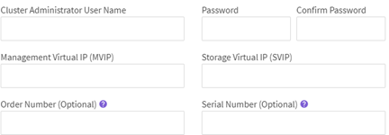

= インストール後のタスクを実行
:allow-uri-read: 
:icons: font
:imagesdir: ../media/

[role="lead"]
SolidFire ESDS をインストールした後、各 SolidFire ESDS ノードにクラスタ名を設定します。その後、 SolidFire ESDS クラスタを作成できます。

.このタスクについて
SolidFire ESDS をインストールした後に完了する必要がある作業の概要を以下に示します。

* <<クラスタ名を設定>>
* <<ライセンスキーを設定します>>
* <<クラスタを作成します>>
* <<クラスタにドライブを追加>>

NOTE: を使用できます link:https://github.com/NetApp-Automation/nar_solidfire_cluster_config["49284958c9d16c4b6d8ee9ddd4ebbca5"^] インストール後の手順を実行するためにネットアップが提供する Ansible のロール。手動で実行する場合は、以下の手順を参照してください。

== クラスタ名を設定

ノードをクラスタに追加する前に、各 SolidFire ESDS ノードにクラスタ名を設定する必要があります。ノード UI または Element API を使用します。

IMPORTANT: クラスタ名はクラスタの作成後に変更することはできません。

.手順
. 次のいずれかのオプションを選択します。
+
** ノード UI を使用します。
+
... ノード単位の管理ノード UI を開きます https://<node_mip>:442`
... 「 * Cluster Settings 」（クラスタ設定）を選択し、クラスタ名を入力します。
... 「 * 変更を適用する * 」を選択します。

** を使用します link:../api/reference_element_api_setclusterconfig.html["acf00854bc64655927abe2f08f53203f"^] API メソッド。
+
このメソッドの入力パラメータは次のとおりです。

+
[cols="5*"]
|===
| 名前 | 説明 | を入力します | デフォルト値 | 必須 

 a| 
「クラスタ」
 a| 
このメソッド呼び出しで変更する必要がある設定属性。このメソッドには、変更するフィールドだけをこのパラメータのメンバーとして追加する必要があります。
 a| 
クラスタ
 a| 
なし
 a| 
いいえ

|===
+
次の要求例を参照してください。

+
[listing]
----
{
   "method": "SetClusterConfig",
   "params": {
      "cluster": {
         "name": "myhost",
         "mipi": "Bond10G"
      },
    "id" : 1
   }
}
----

== ライセンスキーを設定します

SolidFire ESDS クラスタを作成する場合は、ライセンスキー情報が必要です。ネットアップサポートでは、問題の解決に役立つライセンスキー情報も必要になります。SolidFire ESDS クラスタのライセンスキーは、クラスタの注文番号とシリアル番号で構成され、購入済みの容量用語ライセンスモデルがアクティブになります。

.このタスクについて
「ライセンスキー」メソッドを使用すると、 SolidFire ESDS ストレージクラスタのライセンスキーを設定できます。「ライセンスキー」メソッドには、次の入力パラメータがあります。

[cols="5*"]
|===
| 名前 | 説明 | を入力します | デフォルト値 | 必須 

 a| 
「 orderNumber 」
 a| 
このストレージクラスタの新しい受注番号。
 a| 
文字列
 a| 
なし
 a| 
はい。

 a| 
'erialNumber'
 a| 
このストレージクラスタの新しいシリアル番号。
 a| 
文字列
 a| 
なし
 a| 
はい。

|===
このメソッドの戻り値は次のとおりです。

[cols="3*"]
|===
| 名前 | 説明 | を入力します 

 a| 
「 orderNumber 」
 a| 
ストレージクラスタの新しい受注番号。
 a| 
文字列

 a| 
'erialNumber'
 a| 
ストレージクラスタの新しいシリアル番号。
 a| 
文字列

|===
.ステップ
. 次の例に示すように '`S etLicenseKey`API メソッドを使用します
+
このメソッドの要求例を次に示します。

+
[listing]
----
{
  "method": "SetLicenseKey",
  "params": {
    "orderNumber": "33601",
    "serialNumber": "30G56E3WV"   },
   "id" : 1
}
----
+
このメソッドの応答例を次に示します。

+
[listing]
----
{
   "id" : 1,
   "result" : {
      "serialNumber": "30G56E3WV",
      "orderNumber": "33601"
     }
   }
}
----

== クラスタを作成します

各 SolidFire ESDS ストレージノードにクラスタ名を設定したら、ノード UI または Element API を使用してクラスタを作成できます。

IMPORTANT: SolidFire ESDS クラスタでは、保存データのソフトウェア暗号化がデフォルトで有効になっています。デフォルトを変更する場合は 'CreateCluster'API メソッドを使用してクラスタを作成するときに変更する必要があります

.手順
. 次のいずれかのオプションを選択します。
+
** ノード UI を使用します。
+
... ノード単位の管理ノード UI を開きます https://<node_mip>:442*`
... 左側のナビゲーションから、 * クラスタの作成 * を選択します。
... ノードのチェックボックスを選択します。SolidFire ESDS ノードは SFc100 として表示されます。
... 次の情報を入力します。ユーザ名、パスワード、管理仮想 IP （ MVIP ）アドレス、ストレージ仮想 IP （ SVIP ）アドレス、ソフトウェアの注文番号、シリアル番号。
+

NOTE: クラスタの作成後に MVIP アドレスと SVIP アドレスを変更することはできません。MVIP と SVIP に同じ IP アドレスを使用することはできません。

+

NOTE: 最初のクラスタ管理者のユーザ名は変更できません。

+

IMPORTANT: 発注番号とシリアル番号を指定しないと、クラスタの作成処理は失敗します。

+

... ネットアップのエンドユーザライセンス契約を読んでいることを確認します。
... Create Cluster （クラスタの作成） * を選択します。
... クラスタが作成されたことを確認するには ' クラスタ http://mvip_ip` にログインします
... クラスタ名、 SVIP 、 MVIP 、ノード数、および Element のバージョンが正しいことを確認します。

** を使用します link:../api/reference_element_api_createcluster.html["'CreateCluster'"^] API メソッド。
+
このメソッドの入力パラメータは次のとおりです。

+
[cols="5*"]
|===
| 名前 | 説明 | を入力します | デフォルト値 | 必須 

 a| 
「 acceptEula 」
 a| 
このクラスタを作成するときに、エンドユーザライセンス契約を承諾するかどうかを指定します。EULA を承諾するには、このパラメータを TRUE に設定します。
 a| 
ブール値
 a| 
なし
 a| 
はい。

 a| 
「 attributes 」
 a| 
JSON オブジェクト形式の名前と値のペアのリスト。
 a| 
JSON オブジェクト
 a| 
なし
 a| 
いいえ

 a| 
enableSoftwareEncryptionAtRest
 a| 
保存データのソフトウェアベースの暗号化を使用するには、このパラメータを有効にします。SolidFire ESDS クラスタでは、デフォルトで true に設定されています。他のすべてのクラスタのデフォルトは false です。
 a| 
ブール値
 a| 
正しいです
 a| 
いいえ

 a| 
「 MVIP 」
 a| 
管理ネットワークのクラスタのフローティング（仮想） IP アドレス。
 a| 
文字列
 a| 
なし
 a| 
はい。

 a| 
「 nodes 」
 a| 
クラスタを構成するノードの初期セットの CIP / SIP アドレス。このノードの IP はリストに含まれている必要があります。
 a| 
文字列の配列
 a| 
なし
 a| 
はい。

 a| 
「 orderNumber 」
 a| 
英数字の販売注文番号。SolidFire ESDS では必須です。
 a| 
文字列
 a| 
なし
 a| 
いいえ（ハードウェアベースのプラットフォーム）はい（ソフトウェアベースのプラットフォーム）

 a| 
「 password 」と入力します
 a| 
クラスタ管理アカウントの初期パスワード。
 a| 
文字列
 a| 
なし
 a| 
はい。

 a| 
'erialNumber'
 a| 
9 桁の英数字シリアル番号。SolidFire ESDS では必須です。
 a| 
文字列
 a| 
なし
 a| 
いいえ（ハードウェアベースのプラットフォーム）はい（ソフトウェアベースのプラットフォーム）

 a| 
「 VIP 」
 a| 
ストレージ（ iSCSI ）ネットワークのクラスタのフローティング（仮想） IP アドレス。
 a| 
文字列
 a| 
なし
 a| 
はい。

 a| 
「ユーザ名」
 a| 
クラスタ管理者のユーザ名。
 a| 
文字列
 a| 
なし
 a| 
はい。

|===
+
次の要求例を参照してください。

+
[listing]
----
{
  "method": "CreateCluster",
  "params": {
    "acceptEula": true,
    "mvip": "10.0.3.1",
    "svip": "10.0.4.1",
    "repCount": 2,
    "username": "Admin1",
    "password": "9R7ka4rEPa2uREtE",
    "attributes": {
      "clusteraccountnumber": "axdf323456"
    },
    "nodes": [
      "10.0.2.1",
      "10.0.2.2",
      "10.0.2.3",
      "10.0.2.4"
    ]
  },
  "id": 1
}
----

この方法の詳細については、を参照してください link:api/reference_element_api_createcluster.html["'CreateCluster'"^]。

== クラスタにドライブを追加

ドライブがクラスタに参加できるように、 SolidFire ESDS クラスタにドライブを追加する必要があります。これは、 Element UI または API を使用して実行できます。

.手順
. 次のいずれかのオプションを選択します。
+
** Element UI を使用します。
+
... Element UI で、 * Cluster * > * Drives * を選択します。
... 使用可能なドライブのリストを表示するには、「 * Available * 」を選択します。
... ドライブを個別に追加するには、追加するドライブの * Actions * アイコンを選択し、 * Add * を選択します。
... 複数のドライブを追加するには、追加するドライブのチェックボックスを選択し、 * Bulk Actions * を選択し、 * Add * を選択します。
... ドライブが追加され、クラスタの容量が想定どおりであることを確認します。

** を使用します https://docs.netapp.com/us-en/element-software/docs/api/reference_element_api_adddrives.html["775ca0ad68fdedd2fe06eeb23598d120"^] API メソッド。
+
このメソッドの入力パラメータは次のとおりです。

+
[cols="5*"]
|===
| 名前 | 説明 | を入力します | デフォルト値 | 必須 

 a| 
「ドライブ」
 a| 
クラスタに追加する各ドライブに関する情報。有効な値は次のとおり

*** driveID ：追加するドライブの ID （整数）。
*** type ：追加するドライブのタイプ（文字列）。有効な値は「 slice 」、「 block 」、「 volume 」です。省略した場合は、正しいタイプが割り当てられます。

 a| 
JSON オブジェクトの配列
 a| 
なし
 a| 
○（ type は省略可能）

|===
+
要求例を次に示します。

+
[listing]
----
{
  "id": 1,
  "method": "AddDrives",
  "params": {
    "drives": [
      {
        "driveID": 1,
        "type": "slice"
      },
      {
        "driveID": 2,
        "type": "block"
      },
      {
        "driveID": 3,
        "type": "block"
      }
    ]
  }
}
----

この API メソッドの詳細については、を参照してください link:../api/reference_element_api_adddrives.html["775ca0ad68fdedd2fe06eeb23598d120"^]。

== 詳細については、こちらをご覧ください

* https://www.netapp.com/data-storage/solidfire/documentation/["NetApp SolidFire のリソースページ"^]
* https://docs.netapp.com/sfe-122/topic/com.netapp.ndc.sfe-vers/GUID-B1944B0E-B335-4E0B-B9F1-E960BF32AE56.html["以前のバージョンの NetApp SolidFire 製品および Element 製品に関するドキュメント"^]

