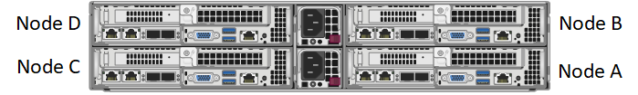

= H シリーズストレージノードを設置
:allow-uri-read: 
:icons: font
:imagesdir: ../media/

[role="lead"]
オールフラッシュストレージシステムを導入する前に、ストレージノードを正しく設置してセットアップする必要があります。

TIP: を参照してください link:../media/hseries_isi.pdf["ポスター"^] 指示を視覚的に表示します。

* <<ワークフロー図>>
* <<設置を準備>>
* <<レールを取り付けます>>
* <<ノードを設置してケーブル接続>>
* <<ノードを設定>>
* <<クラスタを作成します>>

== ワークフロー図

このワークフロー図は、インストール手順の概要を示しています。手順は H シリーズモデルによって多少異なります。

=== H410S

image::../media/h410s_isi_workflow.png[H410S の設置ワークフロー]

=== H610S

NOTE: H610S では、 2U / 4 ノードシャーシと違ってノードとシャーシが別々のコンポーネントではないため、「ノード」と「シャーシ」は同じ意味で使用されます。

image::../media/h610s_isi_workflow.png[H610S の設置ワークフロー]

== 設置を準備

設置準備として、出荷されたハードウェアの中身を確認し、不足しているコンポーネントがある場合はネットアップサポートにお問い合わせください。

設置場所に次のものがあることを確認します。

* システム用のラックスペース。

[cols="2*"]
|===
| ノードタイプ | ラックスペース 

| H410S ノード | 2 ラックユニット（ 2U ） 

| H610S ノード | 1 ラックユニット（ 1U ） 
|===
* SFP28 / SFP+ 直接接続ケーブルまたはトランシーバ
* RJ45 コネクタ付属の CAT5e 以上のケーブル
* システムを設定するためのキーボード、ビデオ、マウス（ KVM ）スイッチ
* USB スティック（オプション）

TIP: 出荷されるハードウェアは、注文内容によって異なります。新しく購入した 2U / 4 ノードの注文には、シャーシ、ベゼル、スライドレールキット、ドライブ、ストレージノードが含まれます。 電源ケーブル（シャーシあたり 2 本）H610S ストレージノードを購入した場合、シャーシにはあらかじめドライブが搭載されています。

CAUTION: ハードウェアの設置時に、梱包材と包装をすべてユニットから取り除いてください。これにより、ノードの過熱やシャットダウンが防止されます。

== レールを取り付けます

出荷時のハードウェアの注文には、一連のスライドレールが含まれています。レールの取り付けを完了するには、ドライバが必要です。インストールの手順は、ノードのモデルごとに多少異なります。

TIP: 装置が転倒しないように、ラックの下から順にハードウェアを設置してください。ラックに安定化デバイスが含まれている場合は、ハードウェアを取り付ける前に取り付けてください。

* <<H410S>>
* <<H610S>>

=== H410S

H410S ノードは、 2 組のアダプタで出荷される 2U / 4 ノード H シリーズシャーシに設置されます。丸穴のラックにシャーシを設置する場合は、丸穴のラックに適したアダプタを使用してください。H410S ノードのレールは、 29 インチ ~ 33.5 インチの奥行きのラックを収容します。レールが完全に収縮すると、長さは 28 インチになり、レールの前部と後部は 1 本のスクリュだけで固定されます。

CAUTION: 完全に契約されたレールにシャーシを設置する場合は、レールの前面と背面のセクションが分かれていることがあります。

.手順
. レールの前面をラック前面ポストの穴に合わせます。
. レール前面のフックをラック前面ポストの穴に押し込み、バネ付きのペグがラックの穴にカチッと収まるまで押し下げます。
. レールをラックにネジで取り付けます。ラックの前面に取り付けられている左側のレールの図を次に示します。
+
image::../media/h410s_rail.gif[2U 用のレール取り付け]

. レールの後部をラックの背面ポストまで伸ばします。
. レール背面のフックを背面ポストの適切な穴に合わせ、レールの前面と背面が同じ高さになるようにします。
. レールの背面をラックに取り付け、レールをネジで固定します。
. ラックの反対側で上記の手順をすべて実行します。

=== H610S

H610S ストレージノードのレールを設置する図を次に示します。

image::../media/h610s_rail_isi.gif[H610S ストレージノードのレールの設置]

TIP: H610S には左右のレールがあります。H610S 取り付けネジを使用してシャーシをレールに固定できるように、ネジ穴を下部に向けます。

== ノードを設置してケーブル接続

H410S ストレージノードは、 2U / 4 ノードシャーシに設置します。H610S の場合、シャーシ / ノードをラックのレールに直接設置します。

CAUTION: 梱包材と包装材をすべてユニットから取り除きます。これにより、ノードの過熱やシャットダウンが防止されます。

* <<H410S>>
* <<H610S>>

=== H410S

.手順
. シャーシに H410S ノードを設置します。4 つのノードを設置したシャーシの背面図の例を次に示します。
+

+

WARNING: ハードウェアを持ち上げてラックに設置する際には十分に注意してください。2 ラックユニット（ 2U ） / 4 ノードシャーシは空の状態で 24.7kg （ 54.45 ポンド）、ノードは 3.6kg （ 8.0 ポンド）です。

. ドライブを取り付けます。
+
image::../media/hci_stor_node_ssd_bays.gif[この図は 2U の前面を示しています]

. ノードをケーブル接続
+

IMPORTANT: シャーシ背面の通気口がケーブルやラベルで塞がれていると、過熱によってコンポーネントで早期に障害が発生する可能性があります。

+
image::../media/hci_isi_storage_cabling.png[この図は、 H410S ストレージノードのケーブル配線を示しています。]

+
** 管理接続用に 2 本の CAT5e 以上のケーブルをポート A と B に接続します。
** SFP28 / SFP+ ケーブルまたはトランシーバをポート C とポート D に 2 本接続し、ストレージ接続に使用します。
** （オプションですが推奨） CAT5e ケーブルを IPMI ポートに接続します（アウトオブバンド管理接続用）。

. シャーシごとに 2 つある電源装置に電源コードを接続し、 240V の PDU または電源コンセントに差し込みます。
. ノードの電源をオンにします
+

NOTE: ノードがブートするまでに約 6 分かかります。

+
image::../media/hci_poweron_isg.gif[この図は、 2U のノードの電源ボタンを示しています]

=== H610S

.手順
. H610S シャーシを設置します。ノード / シャーシをラックに設置する場合の図を次に示します。
+
image::../media/h610s_chassis_isi.gif[に、ラックに設置されている H610S ノード / シャーシを示します。]

+

WARNING: ハードウェアを持ち上げてラックに設置する際には十分に注意してください。H610S シャーシは 18.4 kg （ 40.5 ポンド）です。

. ノードをケーブル接続
+

IMPORTANT: シャーシ背面の通気口がケーブルやラベルで塞がれていると、過熱によってコンポーネントで早期に障害が発生する可能性があります。

+
image::../media/h600s_isi_noderear.png[この図は、 H610S ストレージノードのケーブル配線を示しています。]

+
** SFP28 または SFP+ ケーブルを 2 本使用してノードを 10 / 25GbE ネットワークに接続
** RJ45 コネクタを 2 つ使用してノードを 1GbE ネットワークに接続
** IPMI ポートで RJ-45 コネクタを使用してノードを 1GbE ネットワークに接続
** 両方の電源ケーブルをノードに接続します。

. ノードの電源をオンにします
+

NOTE: ノードがブートするまでに約 5 分 30 秒かかります。

+
image::../media/h600s_isi_nodefront.png[この図は、 H610S シャーシの前面と電源ボタンを示しています。]

== ノードを設定

ハードウェアを設置してケーブルを配線したら、新しいストレージリソースを設定することができます。

.手順
. キーボードとモニタをノードに接続
. 表示されたターミナルユーザインターフェイス（ TUI ）で、画面上の指示に従って、ノードのネットワーク設定とクラスタ設定を行います。
+

NOTE: TUI に表示されるノードの IP アドレスを確認します。このアドレスはクラスタにノードを追加するときに必要になります。設定を保存するとノードは保留状態になり、クラスタに追加できます。詳細については、「 < 設定へのリンクを挿入 > 」を参照してください。

. ベースボード管理コントローラ（ BMC ）を使用してアウトオブバンド管理を設定します。この手順は、 H610S * のノードにのみ適用されます。
+
.. Web ブラウザを使用して、デフォルトの BMC の IP アドレス「 192.168.0.120 」に移動します
.. ユーザ名に * root * 、パスワードに * calvin * を使用してログインします。
.. ノード管理画面で、 * Settings * > * Network Settings * と移動し、アウトオブバンド管理ポートのネットワークパラメータを設定します。

TIP: を参照してください https://kb.netapp.com/Advice_and_Troubleshooting/Hybrid_Cloud_Infrastructure/NetApp_HCI/How_to_access_BMC_and_change_IP_address_on_H610S["この技術情報アーティクル（ログインが必要）"]。

== クラスタを作成します

環境にストレージノードを追加し、新しいストレージリソースを設定したら、新しいストレージクラスタを作成できます

.手順
. 新しく設定したノードと同じネットワーク上のクライアントから、ノードの IP アドレスを入力して NetApp Element ソフトウェア UI にアクセスします。
. [** 新しいクラスタの作成 ** ] ウィンドウに必要な情報を入力します。を参照してください link:../setup/concept_setup_overview.html["セットアップの概要"^] を参照してください。

== 詳細については、こちらをご覧ください

* https://docs.netapp.com/us-en/element-software/index.html["SolidFire および Element ソフトウェアのドキュメント"]
* https://docs.netapp.com/sfe-122/topic/com.netapp.ndc.sfe-vers/GUID-B1944B0E-B335-4E0B-B9F1-E960BF32AE56.html["以前のバージョンの NetApp SolidFire 製品および Element 製品に関するドキュメント"^]

