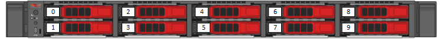

= SF シリーズストレージノードのドライブを交換
:allow-uri-read: 
:icons: font
:imagesdir: ../media/

[role="lead"]
障害が発生したソリッドステートドライブを、交換用ドライブにホットスワップできます。

.必要なもの
* 交換用ドライブが必要です。
* 静電放電（ ESD ）リストバンドを装着するか、静電気防止処置を施しておきます。
* ネットアップサポートに連絡して SSD の交換が必要であることを確認し、正しい解決策の手順を問い合わせておきます。
+
ネットアップサポートに問い合わせる場合は、サービスタグまたはシリアル番号が必要です。サポートは、サービスレベルアグリーメントに従って、交換用ドライブを入手する方法についてもアドバイスします。

この手順は、次の SolidFire ストレージノードモデルに該当します。

* SF2405 のように指定する
* SF3010
* SF4805 の場合
* SF6010
* SF9605
* SF9608
* SF9010
* SF19210 のサポート
* SF38410

[NOTE]
====
Elementソフトウェアのバージョンによっては、次のノードがサポートされません。

* Element 12.7以降、SF2405およびSF9608ストレージノード。
* Element 12.0以降、SF3010、SF6010、およびSF9010ストレージノード。

====
次の図は、 SF9605 シャーシでのドライブの配置を示しています。

NOTE: 上の図は一例です。SF9608 のドライブレイアウトに含まれるドライブは 8 本のみで、左から右に 1~8 の番号が付けられています。

スロット 0 には、ノードのメタデータドライブが格納されます。スロット 0 のドライブを交換する場合は、交換用ドライブの梱包用の箱に入っていたステッカーを貼り、他のドライブとは区別できるようにする必要があります。SF3010 は例外で、メタデータは内蔵の Serial Advanced Technology Attachment （ SATA ）の Dual Inline Memory Module （ DIMM ）に保持されます。

[NOTE]
====
ドライブを取り扱う際は、次のベストプラクティスに従ってください。

* 取り付け準備ができるまで、ドライブを ESD バッグに入れたままにして、静電放電（ ESD ）を防止します。
* ESD バッグに金属製の工具やナイフを入れないでください。
* ESD バッグを手で開けるか、バッグの上部をハサミで切り落とします。
* ESD バッグと梱包材は、あとでドライブの返却が必要になったときのために保管しておいてください。
* 作業中は常に ESD リストストラップを着用し、シャーシの塗装されていない表面部分にリストストラップを接触させます。
* 取り外し、取り付け、持ち運びなど、ドライブを扱うときは常に両手で作業してください。
* ドライブをシャーシに無理に押し込まないでください。
* ドライブ同士を積み重ねないでください。
* ドライブを発送するときは、必ず承認された梱包材を使用し

====
手順の概要は次のとおりです。

*  the drive from the cluster
*  the drive from the chassis
*  the drive to the cluster

== クラスタからドライブを削除します

ドライブの自己診断によりドライブで障害が発生したことがノードに通知された場合、あるいはドライブとの通信が 5 分半以上停止した場合、 SolidFire システムはドライブを障害状態にします。障害ドライブのリストが表示されます。障害が発生したドライブは、 NetApp Element ソフトウェアの障害ドライブリストから削除する必要があります。

.手順
. Element UI で、 * Cluster * > * Drives * を選択します。
. Failed * を選択すると、障害ドライブのリストが表示されます。
. 障害が発生したドライブのスロット番号をメモします。
+
この情報は、障害が発生したドライブをシャーシ内で特定する際に必要になります。

. 次のいずれかの方法で障害ドライブを削除します。
+
[cols="2*"]
|===
| オプション | 手順 

 a| 
個々のドライブを削除する場合
 a| 
.. 削除するドライブに対して * Actions * を選択します。
.. 「 * 削除」を選択します。

 a| 
複数のドライブを削除する
 a| 
.. 削除するドライブをすべて選択し、 * Bulk Actions * を選択します。
.. 「 * 削除」を選択します。

|===

== シャーシからドライブを交換します。

Element UI で障害ドライブのリストから障害ドライブを削除すると、シャーシ内の障害ドライブを物理的に交換できるようになります。

.手順
. 交換用ドライブを開封し、ラックの近くの静電気防止処置を施した平らな場所に置きます。
+
障害ドライブをネットアップに返却するときのために、梱包材は保管しておいてください。

. Element UI から取得した障害ドライブのスロット番号を、シャーシの番号と照合します。
+
次の図は、ドライブスロットの番号を示しています。

+
image::../media/sf_series_drive_numbers.gif[この図は、 SolidFire ストレージノードのドライブ番号を示しています。]

+
[cols="2*"]
|===
| 項目 | 説明 

 a| 
1.
 a| 
ドライブのスロット番号

|===
. 取り外すドライブの赤い丸を押して、ドライブをリリースします。
+
カチッという音がしてラッチが開きます。

. ドライブをシャーシから引き出し、静電気防止処置を施した平らな場所に置きます。
. 交換用ドライブをスロットに挿入する前に、赤い丸を押します。
. 交換用ドライブを挿入し、赤い丸を押してラッチを閉じます。
. ドライブを交換したことをネットアップサポートに通知します。
+
ネットアップサポートから障害ドライブの返却手順をお知らせします。

== クラスタにドライブを追加します

シャーシに新しいドライブを取り付けると、ドライブが使用可能として登録されます。ドライブがクラスタに参加できるようにするためには、 Element UI を使用してドライブをクラスタに追加する必要があります。

.手順
. Element UI で、 * Cluster * > * Drives * をクリックします。
. 使用可能なドライブのリストを表示するには、 * Available * をクリックします。
. 次のいずれかのオプションを選択してドライブを追加します。
+
[cols="2*"]
|===
| オプション | 手順 

 a| 
個々のドライブを追加します
 a| 
.. 追加するドライブの * Actions * ボタンを選択します。
.. 「 * 追加」を選択します。

 a| 
をクリックしてください
 a| 
.. 追加するドライブのチェックボックスを選択し、 * Bulk Actions * を選択します。
.. 「 * 追加」を選択します。

|===

== 詳細については、こちらをご覧ください

* https://www.netapp.com/data-storage/solidfire/documentation/["NetApp SolidFire のリソースページ"^]
* https://docs.netapp.com/sfe-122/topic/com.netapp.ndc.sfe-vers/GUID-B1944B0E-B335-4E0B-B9F1-E960BF32AE56.html["以前のバージョンの NetApp SolidFire 製品および Element 製品に関するドキュメント"^]

