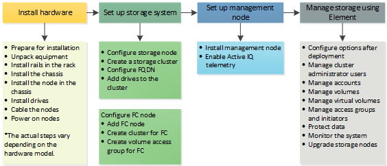

= セットアップの概要
:allow-uri-read: 
:icons: font
:imagesdir: ../media/

[role="lead"]
この時点で、ハードウェアを設置しておく必要があります。ハードウェアには Element ソフトウェアも含まれています。

次に、ご使用の環境に合わせてストレージシステムをセットアップする必要があります。ストレージノードまたは Fibre Channel ノードを含むクラスタをセットアップし、ラックユニットにノードを設置してケーブル接続し、電源をオンにしたら、 Element ソフトウェアを使用してクラスタを管理できます。

.ストレージのセットアップ手順
. 次のいずれかを選択します。
+
** link:../setup/task_setup_cluster_with_storage_nodes.html["ストレージノードを含むクラスタをセットアップする"]
** link:../setup/task_setup_cluster_with_fibre_channel_nodes.html["Fibre Channel ノードを含むクラスタをセットアップします"]

. link:../setup/task_setup_determine_which_solidfire_components_to_install.html["インストールする SolidFire コンポーネントを決定します"]
. link:../setup/task_setup_gh_redirect_set_up_a_management_node.html["管理ノードをセットアップして Active IQ テレメトリを有効にします"]

== 詳細については、こちらをご覧ください

* link:../setup/concept_setup_whats_next.html["ストレージを使用するための次のステップを確認してください"]
* https://docs.netapp.com/us-en/element-software/index.html["SolidFire および Element ソフトウェアのドキュメント"]

