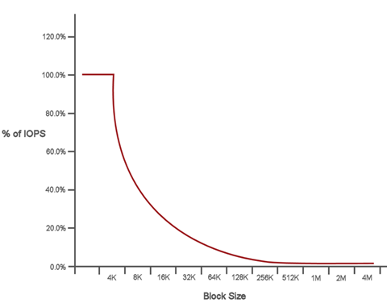

= QoS パフォーマンス曲線
:icons: font
:imagesdir: ../media/

[role="lead"]
サービス品質（ QoS ）パフォーマンス曲線は、ブロックサイズと IOPS の割合の関係を示しています。

アプリケーションが取得できる IOPS には、ブロックサイズと帯域幅が直接影響します。Element ソフトウェアは、ブロックサイズを 4k に正規化することで受信したブロックサイズを考慮します。システムは、ワークロードに応じてブロックサイズを増やすことがあります。ブロックサイズが大きくなると、システムはそのブロックサイズを処理するために必要なレベルまで帯域幅を増やします。帯域幅が増えると、システムが処理可能な IOPS は減少します。

QoS パフォーマンス曲線は、ブロックサイズの増大と IOPS の割合の減少の関係を示しています。

たとえば、ブロックサイズが 4k で帯域幅が 4000KBps であれば、 IOPS は 1000 です。ブロックサイズが 8k に増え、帯域幅が 5000KBps に増えると、 IOPS は 625 まで減少します。ブロックサイズを考慮することで、バックアップやハイパーバイザーアクティビティなど、より大きなブロックサイズを使用する優先度の低いワークロードは、より小さいブロックサイズを使用する優先度の高いトラフィックに必要なパフォーマンスをあまり消費しません。
