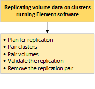

= NetApp Element ソフトウェアを実行しているクラスタ間でリモートレプリケーションを実行
:icons: font
:imagesdir: ../media/

[role="lead"]
Element ソフトウェアを実行するクラスタでは、リアルタイムレプリケーションを使用してボリュームデータのリモートコピーを迅速に作成できます。1 つのストレージクラスタを最大 4 つの他のストレージクラスタとペアリングすることができます。フェイルオーバーやフェイルバックの際には、クラスタペアのどちらかのクラスタからボリュームのデータを同期または非同期でレプリケートできます。

レプリケーションプロセスは次の手順で構成されます。

* link:task_replication_plan_cluster_and_volume_pairing.html["リアルタイムレプリケーションのためのクラスタとボリュームのペアリングを計画します"]
* link:task_replication_pair_clusters.html["レプリケーション用にクラスタをペアリング"]
* link:task_replication_pair_volumes.html["ボリュームをペアリング"]
* link:task_replication_validate_volume_replication.html["ボリュームレプリケーションを検証"]
* link:task_replication_delete_volume_relationship_after_replication.html["レプリケーション後にボリューム関係を削除"]
* link:task_replication_manage_volume_relationships.html["ボリューム関係を管理"]

