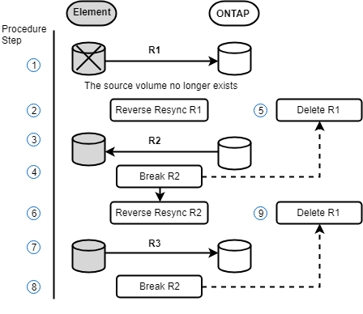

= Elementへのフェイルバックの実行について学ぶ
:allow-uri-read: 
:icons: font
:imagesdir: ../media/

[role="lead"]
プライマリ側の問題が軽減されたら、元のソースボリュームを再同期し、 NetApp Element ソフトウェアへのフェイルバックを実行する必要があります。実行する手順は、元のソースボリュームがまだ存在しているか、あるいは新たに作成したボリュームへのフェイルバックが必要かによって異なります。

== SnapMirror フェイルバックのシナリオ

SnapMirror ディザスタリカバリ機能について、 2 つのフェイルバックシナリオを例に説明します。どちらのシナリオも、元の関係がフェイルオーバーされた（解除された）状況を前提としています。

参考のために、対応する手順の各ステップを付記します。

NOTE: 以下の各例の R1 は元の関係で、 NetApp Element ソフトウェアを実行しているクラスタが元のソースボリューム（ Element ）、 ONTAP が元のデスティネーションボリューム（ ONTAP ）です。R2 と R3 は、逆再同期処理で作成された逆の関係です。

次の図は、ソースボリュームが存在する場合のフェイルバックシナリオを示しています。

image::../media/snapmirror_element_failback1.gif[ソースボリュームがまだ存在する場合のフェイルバックシナリオの画像]

次の図は、ソースボリュームが存在しない場合のフェイルバックシナリオを示しています。

== 詳細については、こちらをご覧ください

* xref:task_snapmirror_perform_failback_when_source_volume_exists.adoc[ソースボリュームが存在する場合は、フェイルバックを実行します]
* xref:task_snapmirror_performing_failback_when_source_volume_no_longer_exists.adoc[ソースボリュームが存在しない場合にフェイルバックを実行します]
* xref:concept_snapmirror_failback_scenarios.adoc[SnapMirror フェイルバックのシナリオ]

